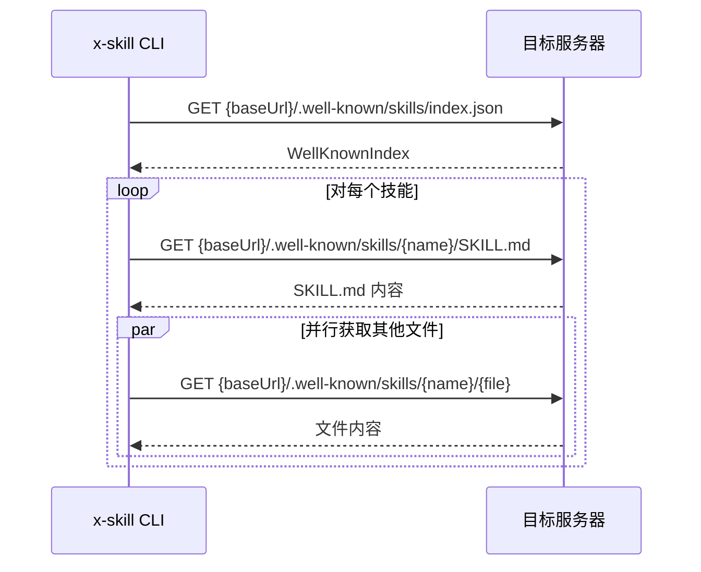

# 服务端接口与数据结构

x-skill CLI 与多个外部服务交互。本文档详细说明每个接口的请求/响应格式和数据结构。

## 接口总览

| 接口 | 基地址 | 用途 | 调用位置 |
|------|--------|------|---------|
| [技能搜索 API](#1-技能搜索-api) | `https://skills.sh` | `find` 命令搜索技能 | `src/find.ts` |
| [遥测上报 API](#2-遥测上报-api) | `https://add-skill.vercel.sh/t` | 匿名使用统计 | `src/telemetry.ts` |
| [安全审计 API](#3-安全审计-api) | `https://add-skill.vercel.sh/audit` | 安装前安全评估 | `src/telemetry.ts` |
| [GitHub Trees API](#4-github-trees-api) | `https://api.github.com` | 更新检查（hash 对比） | `src/skill-lock.ts` |
| [GitHub Repos API](#5-github-repos-api) | `https://api.github.com` | 检测仓库是否私有 | `src/source-parser.ts` |
| [Well-known Skills](#6-well-known-skills-协议) | 任意域名 | RFC 8615 技能发现 | `src/providers/wellknown.ts` |

---

## 1. 技能搜索 API

用于 `x-skill find` 命令，通过关键词搜索技能。

### 请求

```
GET {SKILLS_API_BASE}/api/search?q={query}&limit=10
```

- **基地址**：`process.env.SKILLS_API_URL || 'https://skills.sh'`
- **方法**：GET
- **参数**：

| 参数 | 类型 | 说明 |
|------|------|------|
| `q` | string | 搜索关键词，URL 编码 |
| `limit` | number | 最大返回数量（默认 10） |

### 响应

```typescript
// HTTP 200
{
  skills: Array<{
    id: string;       // 技能唯一标识（slug）
    name: string;     // 技能名称
    installs: number; // 安装次数
    source: string;   // 来源标识（如 "vercel-labs/agent-skills"）
  }>
}
```

### 客户端数据结构

```typescript
// src/find.ts
interface SearchSkill {
  name: string;     // 技能名称
  slug: string;     // 唯一标识（对应 API 的 id）
  source: string;   // 来源标识
  installs: number; // 安装次数
}
```

### 错误处理

- 非 200 响应或网络错误：返回空数组 `[]`

---

## 2. 遥测上报 API

匿名使用数据收集，fire-and-forget 方式，不阻塞主流程。

### 请求

```
GET https://add-skill.vercel.sh/t?{params}
```

- **方法**：GET（参数通过 URL query string 传递）
- **发送方式**：`fetch().catch(() => {})` — 不 await，不处理错误

### 公共参数

| 参数 | 类型 | 说明 |
|------|------|------|
| `v` | string | CLI 版本号 |
| `ci` | `'1'` | 在 CI 环境中附加 |
| `event` | string | 事件类型（见下） |

### 事件类型与参数

#### install 事件

安装技能时触发（仅公开仓库）。

```typescript
interface InstallTelemetryData {
  event: 'install';
  source: string;       // 来源标识（如 "owner/repo"）
  skills: string;       // 逗号分隔的技能名
  agents: string;       // 逗号分隔的代理名
  global?: '1';         // 是否全局安装
  skillFiles?: string;  // JSON: { skillName: "relative/path/to/SKILL.md" }
  sourceType?: string;  // "github" | "well-known" | 其他 provider ID
}
```

#### remove 事件

移除技能时触发。

```typescript
interface RemoveTelemetryData {
  event: 'remove';
  source?: string;      // 来源标识
  skills: string;       // 逗号分隔的技能名
  agents: string;       // 逗号分隔的代理名
  global?: '1';
  sourceType?: string;
}
```

#### check 事件

检查更新时触发。

```typescript
interface CheckTelemetryData {
  event: 'check';
  skillCount: string;       // 检查的技能数量
  updatesAvailable: string; // 有更新的数量
}
```

#### update 事件

执行更新时触发。

```typescript
interface UpdateTelemetryData {
  event: 'update';
  skillCount: string;   // 尝试更新的技能数量
  successCount: string; // 成功数量
  failCount: string;    // 失败数量
}
```

#### find 事件

搜索技能时触发。

```typescript
interface FindTelemetryData {
  event: 'find';
  query: string;        // 搜索关键词
  resultCount: string;  // 结果数量
  interactive?: '1';    // 交互式搜索
}
```

#### experimental_sync 事件

同步 node_modules 技能时触发。

```typescript
interface SyncTelemetryData {
  event: 'experimental_sync';
  skillCount: string;   // 发现的技能数量
  successCount: string; // 成功安装数量
  agents: string;       // 目标代理
}
```

### 禁用条件

```typescript
function isEnabled(): boolean {
  return !process.env.DISABLE_TELEMETRY && !process.env.DO_NOT_TRACK;
}
```

### 跳过遥测的场景

| 场景 | 判断逻辑 |
|------|---------|
| 本地路径安装 | `getOwnerRepo(parsed)` 返回 `null` → 跳过 `track()` |
| 私有 GitHub 仓库 | `isRepoPrivate()` 返回 `true` → 跳过 `track()` |
| 无法判断是否私有 | `isRepoPrivate()` 返回 `null` → 跳过 `track()`（保守策略） |
| 环境变量禁用 | `DISABLE_TELEMETRY` 或 `DO_NOT_TRACK` 被设置 |

---

## 3. 安全审计 API

在 `add` 命令中并行请求，展示技能的安全风险评估。不阻塞安装。

### 请求

```
GET https://add-skill.vercel.sh/audit?source={source}&skills={skills}
```

- **方法**：GET
- **超时**：3000ms（通过 AbortController）
- **参数**：

| 参数 | 类型 | 说明 |
|------|------|------|
| `source` | string | 来源标识（如 `"vercel-labs/agent-skills"`） |
| `skills` | string | 逗号分隔的技能 slug 列表 |

### 响应

```typescript
// HTTP 200
// AuditResponse = Record<skillSlug, SkillAuditData>
// SkillAuditData = Record<partnerName, PartnerAudit>
{
  "react-best-practices": {
    "ath": {                    // Gen（通用评估）
      "risk": "safe",           // "safe" | "low" | "medium" | "high" | "critical" | "unknown"
      "analyzedAt": "2025-..."
    },
    "socket": {                 // Socket.dev
      "risk": "safe",
      "alerts": 0,              // 告警数量
      "analyzedAt": "2025-..."
    },
    "snyk": {                   // Snyk
      "risk": "low",
      "score": 85,              // 安全评分
      "analyzedAt": "2025-..."
    }
  }
}
```

### 客户端数据结构

```typescript
// src/telemetry.ts
interface PartnerAudit {
  risk: 'safe' | 'low' | 'medium' | 'high' | 'critical' | 'unknown';
  alerts?: number;       // 告警数（Socket.dev）
  score?: number;        // 评分（Snyk）
  analyzedAt: string;    // ISO 时间戳
}

type SkillAuditData = Record<string, PartnerAudit>;  // partner → audit
type AuditResponse = Record<string, SkillAuditData>;  // skill → partners
```

### 错误处理

- 超时（3s）、非 200、网络错误：返回 `null`，静默跳过安全展示

---

## 4. GitHub Trees API

用于 `check` 和 `update` 命令，获取技能文件夹的 tree SHA 以检测更新。

### 请求

```
GET https://api.github.com/repos/{owner}/{repo}/git/trees/{branch}?recursive=1
```

- **方法**：GET
- **分支**：依次尝试 `main`、`master`
- **Headers**：

```typescript
{
  'Accept': 'application/vnd.github.v3+json',
  'User-Agent': 'x-skill-cli',
  'Authorization': 'Bearer {token}'  // 可选，提高 rate limit
}
```

### 响应

```typescript
// HTTP 200
{
  sha: string;  // 根 tree SHA
  tree: Array<{
    path: string;   // 文件/目录相对路径（如 "skills/my-skill"）
    type: string;   // "tree"（目录）或 "blob"（文件）
    sha: string;    // 该节点的 SHA
  }>
}
```

### 使用逻辑

1. 从全局 lock 文件读取已安装技能的 `skillFolderHash`（之前安装时保存的 tree SHA）
2. 调用 Trees API 获取仓库完整目录树
3. 在返回的 `tree` 数组中找到 `type === 'tree'` 且 `path` 匹配技能文件夹的条目
4. 对比该条目的 `sha` 与本地保存的 `skillFolderHash`
5. 不一致则表示有更新

### Token 获取优先级

```typescript
// src/skill-lock.ts — getGitHubToken()
1. process.env.GITHUB_TOKEN
2. process.env.GH_TOKEN
3. execSync('gh auth token')  // gh CLI 认证
```

---

## 5. GitHub Repos API

用于判断仓库是否为私有仓库，决定是否发送遥测。

### 请求

```
GET https://api.github.com/repos/{owner}/{repo}
```

- **方法**：GET
- **无认证**（使用公开 API）

### 响应

```typescript
// HTTP 200
{
  private: boolean;  // true = 私有，false = 公开
  // ... 其他字段（未使用）
}
```

### 返回值映射

| HTTP 状态 | 返回 | 含义 |
|-----------|------|------|
| 200 + `private: true` | `true` | 确认私有 → 跳过遥测 |
| 200 + `private: false` | `false` | 确认公开 → 发送遥测 |
| 非 200 / 网络错误 | `null` | 无法判断 → 保守跳过遥测 |

---

## 6. Well-known Skills 协议

基于 RFC 8615 的技能发现协议，允许任意网站发布可安装的技能。

### 发现流程



### 索引文件

```
GET {baseUrl}/.well-known/skills/index.json
```

#### URL 尝试顺序

1. `{baseUrl}/.well-known/skills/index.json`（路径相对）
2. `{origin}/.well-known/skills/index.json`（根路径回退）

#### 响应结构

```typescript
// WellKnownIndex
{
  skills: Array<{
    name: string;         // 技能标识符（1-64 字符，小写字母数字和连字符）
    description: string;  // 技能描述
    files: string[];      // 技能目录下的所有文件，必须包含 "SKILL.md"
  }>
}
```

#### 校验规则

- `skills` 必须是数组
- 每个条目必须有 `name`（`/^[a-z0-9]([a-z0-9-]{0,62}[a-z0-9])?$/`）、`description`、`files`
- `files` 数组必须包含 `SKILL.md`
- `files` 中的路径不能以 `/` 或 `\` 开头，不能包含 `..`（防路径穿越）

### 技能文件获取

```
GET {baseUrl}/.well-known/skills/{skill-name}/SKILL.md
GET {baseUrl}/.well-known/skills/{skill-name}/{other-file}
```

SKILL.md 必须包含有效的 YAML frontmatter（`name` 和 `description` 字段）。

### 客户端数据结构

```typescript
// src/providers/wellknown.ts
interface WellKnownSkillEntry {
  name: string;        // 技能标识符
  description: string; // 技能描述
  files: string[];     // 文件列表
}

interface WellKnownIndex {
  skills: WellKnownSkillEntry[];
}

interface WellKnownSkill extends RemoteSkill {
  files: Map<string, string>;        // 文件路径 → 内容
  indexEntry: WellKnownSkillEntry;   // 来自 index.json 的条目
}
```

### Provider 接口（可扩展）

所有远程技能提供者实现统一接口：

```typescript
// src/providers/types.ts
interface HostProvider {
  readonly id: string;           // 提供者 ID
  readonly displayName: string;  // 显示名称

  match(url: string): ProviderMatch;
  fetchSkill(url: string): Promise<RemoteSkill | null>;
  toRawUrl(url: string): string;
  getSourceIdentifier(url: string): string;
}

interface ProviderMatch {
  matches: boolean;
  sourceIdentifier?: string;
}

interface RemoteSkill {
  name: string;          // 显示名称
  description: string;   // 描述
  content: string;       // SKILL.md 完整内容
  installName: string;   // 安装目录名
  sourceUrl: string;     // 原始来源 URL
  metadata?: Record<string, unknown>;
}
```

---

## Lock 文件数据结构

### 全局 Lock（`~/.agents/.skill-lock.json`）

```typescript
// src/skill-lock.ts
interface SkillLockFile {
  version: 3;
  skills: Record<string, SkillLockEntry>;
  dismissed?: { findSkillsPrompt?: boolean };
  lastSelectedAgents?: string[];
}

interface SkillLockEntry {
  source: string;           // 规范化来源（如 "owner/repo"）
  sourceType: string;       // "github" | "gitlab" | "well-known" | "local" | "git"
  sourceUrl: string;        // 原始安装 URL
  skillPath?: string;       // 仓库内的技能路径（如 "skills/my-skill/SKILL.md"）
  skillFolderHash: string;  // GitHub tree SHA（用于更新检测）
  installedAt: string;      // ISO 首次安装时间
  updatedAt: string;        // ISO 最后更新时间
  pluginName?: string;      // 所属插件名
}
```

### 项目 Lock（`./skills-lock.json`）

```typescript
// src/local-lock.ts
interface LocalSkillLockFile {
  version: 1;
  skills: Record<string, LocalSkillLockEntry>;
}

interface LocalSkillLockEntry {
  source: string;       // 来源标识
  sourceType: string;   // "github" | "node_modules" | "local" 等
  computedHash: string; // SHA-256（基于文件内容，非 GitHub tree SHA）
}
```

---

## 网络请求策略

| 策略 | 说明 |
|------|------|
| **超时** | 安全审计 API 固定 3s；其他请求无显式超时 |
| **重试** | 无自动重试机制 |
| **并行** | 审计请求与用户交互并行；Well-known 多文件并行获取 |
| **降级** | 所有外部请求失败均静默降级，不阻塞主功能 |
| **认证** | GitHub API 可选 token（提高 rate limit）；其他接口无认证 |
| **缓存** | CLI 端无缓存；GitHub Trees API 始终获取最新数据 |
