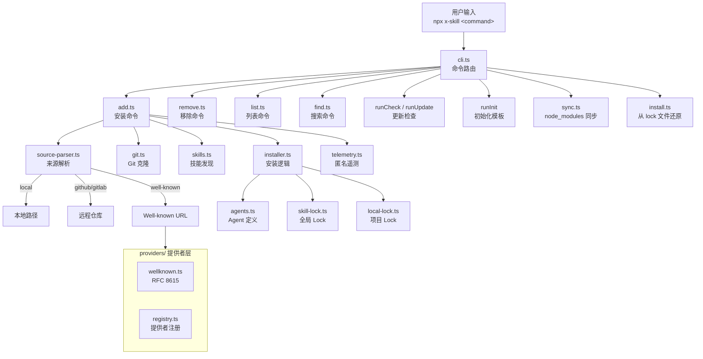
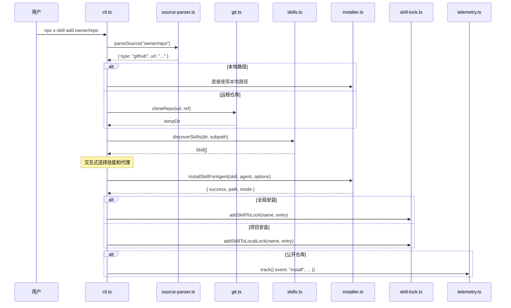

# 系统架构总览

## 项目定位

x-skill 是一个开放的 Agent Skills 生态 CLI 工具，用于安装、管理和发现 AI 编码代理的技能包。它支持 40+ 种主流编码代理（Claude Code、Cursor、Codex、Gemini CLI 等），可以从 GitHub、GitLab、本地目录、Well-known URL 等多种来源安装技能。

## 核心概念

| 概念 | 说明 |
|------|------|
| **Skill（技能）** | 以 `SKILL.md` 文件定义的指令集，扩展编码代理的能力 |
| **Agent（代理）** | 编码工具，如 Claude Code、Cursor，每个有独立的技能存储路径 |
| **Source（来源）** | 技能的安装来源：GitHub 仓库、本地目录、Git URL 等 |
| **Universal Agent** | 共享 `.agents/skills/` 路径的代理，安装一次即可服务多个代理 |
| **Lock File** | 记录已安装技能的元数据，用于更新检查和项目还原 |

## 整体架构图



## 目录结构

```
src/
├── cli.ts              # 入口文件，命令路由，banner/help，check/update 实现
├── add.ts              # add 命令核心：来源解析 → 技能发现 → 交互选择 → 安装
├── remove.ts           # remove 命令：扫描已安装技能 → 选择 → 卸载 → 更新 lock
├── list.ts             # list 命令：列出项目/全局已安装技能
├── find.ts             # find 命令：通过 skills.sh API 搜索技能
├── install.ts          # experimental_install：从 skills-lock.json 还原技能
├── sync.ts             # experimental_sync：从 node_modules 同步技能
├── source-parser.ts    # 来源字符串解析（GitHub shorthand、本地路径、URL 等）
├── git.ts              # Git 仓库克隆（simple-git）与临时目录管理
├── skills.ts           # 技能发现：扫描目录 → 解析 SKILL.md frontmatter
├── installer.ts        # 安装执行：symlink/copy 模式，路径安全校验
├── agents.ts           # Agent 配置定义：40+ 编码代理的路径和检测逻辑
├── skill-lock.ts       # 全局 lock 文件管理（~/.agents/.skill-lock.json）
├── local-lock.ts       # 项目 lock 文件管理（skills-lock.json）
├── telemetry.ts        # 匿名遥测：fire-and-forget，可禁用
├── types.ts            # TypeScript 类型定义
├── constants.ts        # 常量定义（AGENTS_DIR, SKILLS_SUBDIR）
├── plugin-manifest.ts  # Claude Code 插件市场清单发现
├── prompts/            # 自定义交互提示组件
│   └── search-multiselect.ts
└── providers/          # 远程技能提供者
    ├── index.ts        # 导出入口
    ├── types.ts        # 提供者接口定义
    ├── registry.ts     # 提供者注册表
    └── wellknown.ts    # RFC 8615 Well-known 技能提供者

tests/                  # 测试文件
scripts/                # 构建和维护脚本
bin/
└── cli.mjs             # Node.js 入口 shim
```

## 核心数据流

### 技能安装流程（`x-skill add`）



### 安装模式

| 模式 | 说明 | 适用场景 |
|------|------|---------|
| **Symlink** | 在 `.agents/skills/` 下存一份，其他代理目录创建符号链接 | 推荐，单一数据源 |
| **Copy** | 直接复制到每个代理目录 | Windows 或不支持符号链接时 |

对于 **Universal Agent**（共享 `.agents/skills/` 路径的代理），文件直接写入规范路径，无需符号链接。

### Lock 文件系统

| Lock 文件 | 路径 | 用途 |
|-----------|------|------|
| 全局 Lock | `~/.agents/.skill-lock.json`（或 `$XDG_STATE_HOME/x-skill/.skill-lock.json`） | 跟踪全局安装的技能，支持 `check` 和 `update` |
| 项目 Lock | `./skills-lock.json` | 跟踪项目级技能，用于 `experimental_install` 还原 |

全局 Lock 使用 GitHub Tree SHA 作为 `skillFolderHash`，通过对比远程 hash 来检测更新。
项目 Lock 使用本地文件内容的 SHA-256 hash。

## 服务端交互

CLI 与多个外部服务交互，详见 [服务端接口与数据结构](./api-reference.md)。

| 接口 | 基地址 | 用途 |
|------|--------|------|
| 技能搜索 API | `https://skills.sh/api/search` | `find` 命令搜索技能 |
| 遥测上报 API | `https://add-skill.vercel.sh/t` | 匿名使用统计（fire-and-forget） |
| 安全审计 API | `https://add-skill.vercel.sh/audit` | 安装前安全风险评估 |
| GitHub Trees API | `https://api.github.com/.../git/trees/` | 更新检查（tree SHA 对比） |
| GitHub Repos API | `https://api.github.com/repos/` | 检测仓库是否私有 |
| Well-known Skills | `{domain}/.well-known/skills/` | RFC 8615 技能发现协议 |

## 关键设计决策

1. **本地安装不上报遥测**：当 `parseSource()` 返回 `type: 'local'` 时，`getOwnerRepo()` 返回 `null`，跳过所有 `track()` 调用。
2. **符号链接优先**：多目标代理安装时默认使用 symlink，失败自动 fallback 到 copy。
3. **路径安全**：通过 `sanitizeName()` 和 `isPathSafe()` 防止路径穿越攻击。
4. **遥测可选**：设置 `DISABLE_TELEMETRY` 或 `DO_NOT_TRACK` 环境变量即可关闭。
5. **Fire-and-forget 遥测**：`track()` 不使用 `await`，不会阻塞安装流程。
